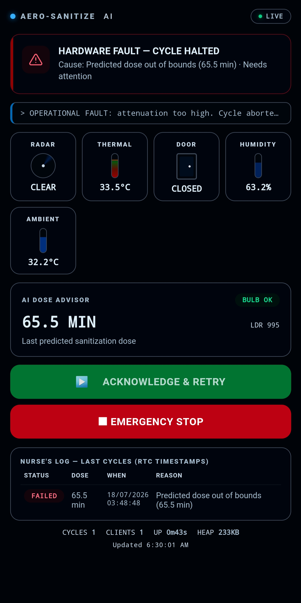

# 🧬 Aero-Sanitize AI

**A failsafe, sensor-fusion UV-C sterilization controller for resource-limited clinics.**
Built on the ESP32-S3 · No internet required · Nurse-facing web dashboard over SoftAP


<!-- docs/images/dashboard-hero.png -->


---

## ⚠️ The Problem

Standard UV-C sterilization systems rely on a single passive-infrared (PIR) motion sensor to confirm a room is empty. PIR sensors frequently miss **anesthetized, sedated, or motionless patients**, which can lead to severe UV-C radiation burns if the lamp fires with someone still inside.

## 💡 The Approach: Sensor Fusion

Aero-Sanitize AI requires **simultaneous agreement from independent sensors** before the 220V UV-C relay is allowed to close. The firmware treats "room is safe" as a hard AND of every input — one bad reading is enough to block or abort a cycle:

| Signal | Sensor | What it catches |
|---|---|---|
| Micro-motion | CDM324 Doppler radar | Any movement, including subtle motion a PIR sensor would miss |
| Body heat | AMG8833 8×8 thermal camera | A human heat signature even when a person is still |
| Physical access | MC-38 magnetic reed switch | Whether the door is actually shut |

Only when radar is clear, the hottest thermal pixel is below the body-heat threshold, **and** the door is confirmed closed does the system arm. It then runs a 10-second pre-ignition scan to confirm the room *stays* clear before the lamp ignites — and if any sensor trips mid-cycle, the lamp is cut within one control-loop tick.

> **Design note:** the BOM includes an LDR light sensor, an RTC module, and a DHT22 as supporting/logging hardware. Only the DHT22 (ambient temp/humidity, informational only) is currently read by the firmware. The LDR and RTC are **not yet wired into `isRoomSafe()`** — see [Roadmap](#-roadmap) below. Keep this in mind when describing the safety guarantees to reviewers.

---

## 🧠 State Machine

```
STANDBY → (room safe for 10s) → SCANNING → (10s clear) → UVC_ACTIVE → (60s) → STANDBY
   ↑                                  |                        |
   └──────────── UNSAFE ←─────────────┴────────────────────────┘
                  (any sensor trips → lamp killed instantly)
```

- **STANDBY** – lamp off, watching sensors, auto-starts after 10s of a continuously clear room (or a nurse can trigger it manually from the dashboard).
- **SCANNING** – a 10-second "are you sure" window before ignition.
- **UVC_ACTIVE** – lamp on, 60-second sterilization cycle, aborts instantly on any sensor violation.
- **UNSAFE** – lamp forced off; auto-recovers to STANDBY once the room is clear again.

The whole loop is non-blocking (`millis()`-based, no `delay()`), so the safety check can never be frozen out by a slow network request.

---

## 🛠️ Hardware

| Component | Reference | Voltage |
|---|---|---|
| Microcontroller | ESP32-S3 WROOM N16R8, 44-pin | 3.3V |
| Thermal camera | AMG8833 (8×8 pixel array) | 3.3V |
| Doppler radar | CDM324 5.8GHz | 5V |
| Signal amplification | 2× LM358 op-amp | 5V |
| Light sensor *(planned)* | LDR photoresistor module | 3.3V |
| Door sensors | 2× MC-38 magnetic reed switch | 3.3V |
| Relay | 5V, 1-channel, 10A/250VAC | 5V |
| Ambient sensor | DHT22 (temp/humidity, logging only) | 3.3V |
| RTC *(planned)* | DS3231 + AT24C32 I2C, battery-free | 3.3V |
| Battery | LIR2032 | 3V |
| Lamp | Standard 220V blue LED (demo stand-in for UV-C) | 220V |

Full BOM with part counts and connectors: [`docs/BOM.md`](docs/BOM.md).

> The 5V analog output of the LM358 amplifier chain is stepped down through a resistor voltage divider before reaching the ESP32's 3.3V-tolerant ADC pins.

---

## 💻 Software

- **C++ / Arduino framework** on ESP32-S3, non-blocking state machine.
- **SoftAP dashboard** – the ESP32 hosts its own Wi-Fi network (`AeroSanitize-AI`) and serves a mobile-friendly live dashboard at `http://192.168.4.1`, so a nurse can watch cycle status from a phone with zero hospital IT dependency.
- **Live polling** – the dashboard polls `/data` once per second (JSON), with connection-loss detection and an "OFFLINE" state if the controller stops responding.
- **Manual override** – `/start` and `/stop` endpoints let staff manually trigger a cycle or hit Emergency Stop.
- **Digital twin** – behavior validated in Webots R2023b via a Python controller before flashing physical hardware.

### API

| Route | Method | Purpose |
|---|---|---|
| `/` | GET | Serves the dashboard (cached 10 min, static) |
| `/data` | GET | Live JSON sensor/state snapshot, no-cache |
| `/start` | POST | Manually begin the pre-ignition scan (rejected unless STANDBY + safe) |
| `/stop` | POST | Emergency stop — force lamp off, return to STANDBY |

---

## 🚀 Getting Started

1. Clone this repo.
2. Open `firmware/AeroSanitize_Main/AeroSanitize_Main.ino` in Arduino IDE 2.x.
3. Board: **ESP32S3 Dev Module**.
4. Install libraries: `Adafruit_AMG88xx`, `DHT sensor library`.
5. Wire hardware per [`docs/wiring-diagram.png`](docs/wiring-diagram.png).
6. Compile and upload.
7. Connect your phone to the `AeroSanitize-AI` Wi-Fi network, then open `http://192.168.4.1` in a browser.
8. Optional: open Serial Monitor at `115200` baud for real-time state-machine logs.

---

## 📁 Repo Structure

```
Aero-Sanitize-AI/
├── README.md
├── LICENSE
├── firmware/
│   └── AeroSanitize_Main/
│       └── AeroSanitize_Main.ino
├── simulation/                 # Webots digital-twin controller (if applicable)
│   └── webots_controller.py
├── docs/
│   ├── BOM.md                  # Full bill of materials (from your table)
│   ├── wiring-diagram.png       # Fritzing/schematic export
│   ├── system-architecture.png  # Block diagram: sensors → MCU → relay → dashboard
│   └── images/
│       ├── logo.png
│       ├── dashboard-hero.png   # Screenshot of the live dashboard
│       └── prototype-photo.jpg  # Photo of the built breadboard/enclosure
└── .gitignore
```


## 🗺️ Roadmap

- [ ] Wire the LDR into `isRoomSafe()` as a fourth confirmation signal (room must also be unlit)
- [ ] Integrate DS3231 RTC for timestamped cycle logging (currently no persistent log)
- [ ] Move UV-C dose tracking (cumulative lamp-on time) into persistent storage
- [ ] Physical enclosure + IP-rated sensor housing for clinical deployment

---

## 📜 License

MIT — see [`LICENSE`](LICENSE).

---

*Built by **IES PES ENET'Com SBJC** for the APC Project Competition.*
