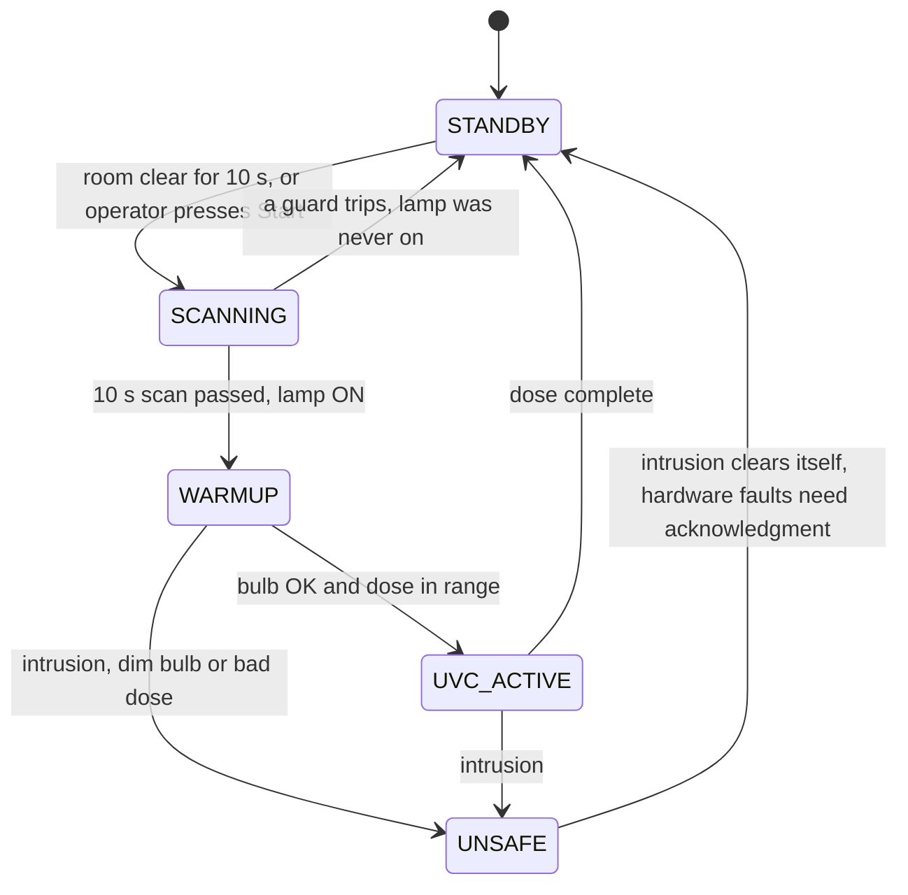
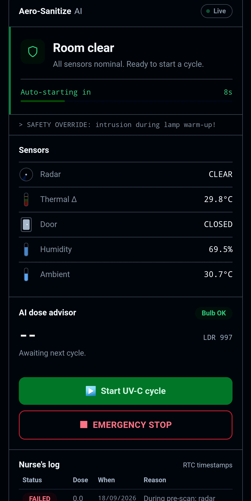
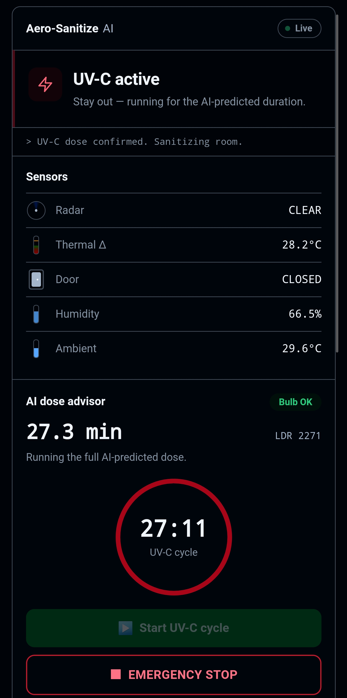
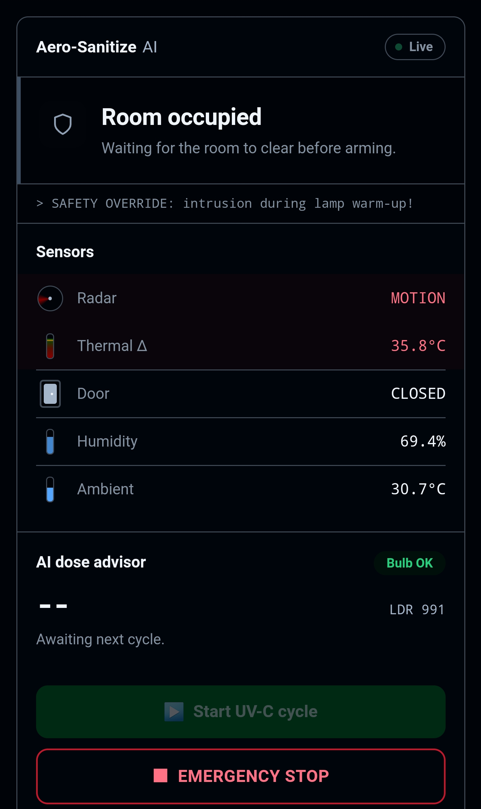
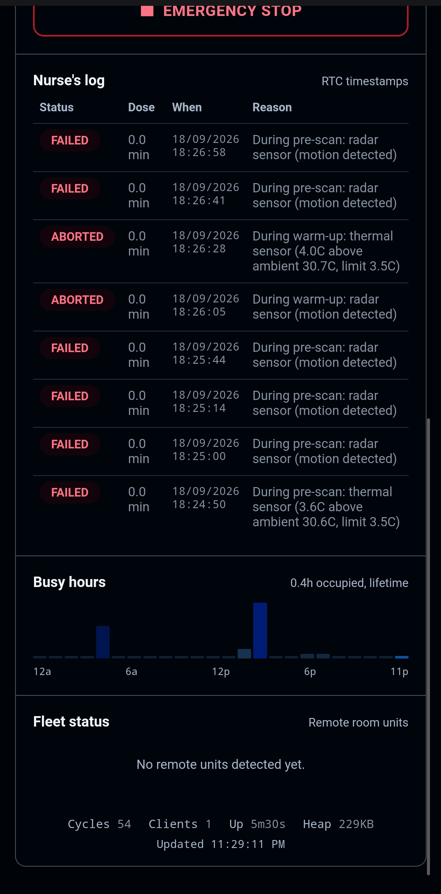
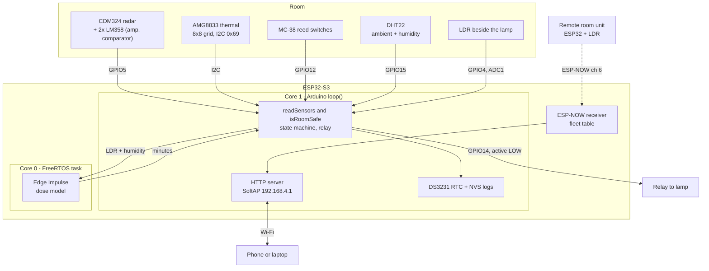
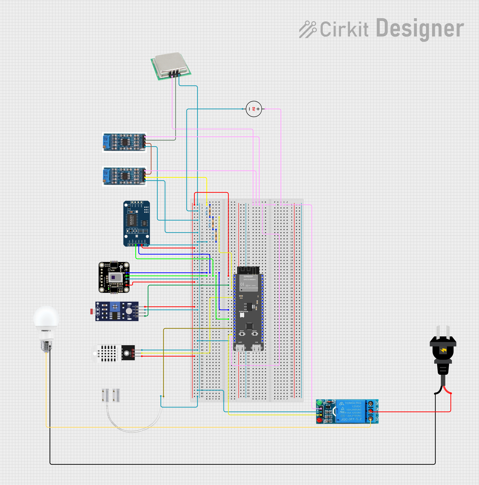
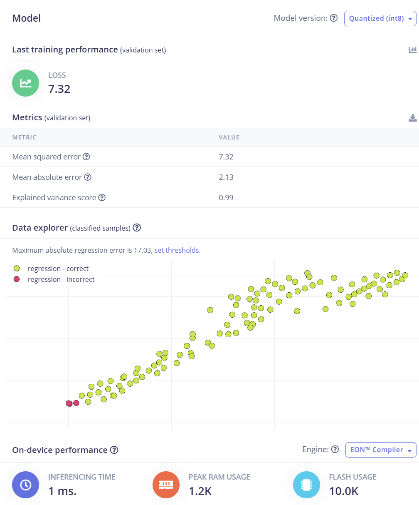

# Aero-Sanitize AI

A ceiling-mounted UV-C controller that will not switch the lamp on until three independent sensors agree the room is empty. ESP32-S3, roughly $50 in parts, and it runs completely offline: the controller hosts its own Wi-Fi network and dashboard, so a clinic doesn't need an IT department to use it.


*Above: a person enters during a cycle. The lamp relay drops and the dashboard flips to "Cycle interrupted".*

---

## Why we built it

Most UV-C room sterilizers are triggered by a PIR motion sensor. PIR only reacts to *changes* in infrared, so a patient who is sedated, anesthetized or simply asleep and lying still looks exactly like an empty bed. UV-C burns skin and eyes. Getting that wrong once is enough.

So this project doesn't trust motion alone. Before the lamp is allowed to ignite, three different physical measurements all have to say "nobody here", and they keep being checked for as long as the lamp is on.

## The three guards

| Guard | Hardware | What it is looking for | Trips when |
|---|---|---|---|
| Radar | CDM324 Doppler module, two-stage LM358 conditioning | Movement at breathing scale, including under a blanket | Radar output goes HIGH |
| Thermal | AMG8833 8×8 infrared array | Body heat | Hottest pixel is more than 3.5 °C above the room air temperature, or above 42 °C outright |
| Door | MC-38 magnetic reed switches | Someone opening the door | Contact opens |

If any guard trips, the lamp doesn't start, or, if it's already on, the relay is dropped immediately. There's no voting and no weighting. It's an AND of three conditions written as plain C++ booleans (`isRoomSafe()` in the main sketch).

There is also a fourth sensor, an **LDR** mounted next to the lamp, but it is *not* a presence sensor. An unlit room doesn't mean an empty room, so the LDR is only used to check that the bulb is actually putting out light. More on that below.

## What a cycle looks like

1. **Standby.** The unit watches the room. Once all three guards have been clear for 10 seconds it arms itself (or an operator presses Start on the dashboard).
2. **Pre-ignition scan.** A further 10 seconds with the lamp **off**. If anything trips, the scan is abandoned and logged as `FAILED`. The lamp never came on.
3. **Warm-up.** The relay closes. After 4 seconds the LDR and the DHT22 humidity reading are frozen together and handed to the TinyML model.
4. **Dose check.** The model returns a UV-C run time in minutes. Two gates apply before the cycle continues: the bulb has to be bright enough (LDR ≥ 550), and the predicted dose has to be sane (≤ 60 min). Fail either and the lamp goes off and the unit latches a hardware fault.
5. **UV-C active.** The lamp runs for the predicted time while the three guards keep checking every 300 ms.
6. **Done.** Logged as `COMPLETED` with an RTC timestamp, and the unit goes back to standby. The next auto-arm needs a fresh 10 seconds of clear room.

If a guard trips during warm-up or the active cycle, the relay is switched off first and the log entry is written afterwards. Writing to the RTC and flash is slower than flipping a pin, and the lamp is the thing that matters.


```mermaid
stateDiagram-v2
    [*] --> STANDBY
    STANDBY --> SCANNING: room clear for 10 s, or operator presses Start
    SCANNING --> STANDBY: a guard trips, lamp was never on
    SCANNING --> WARMUP: 10 s scan passed, lamp ON
    WARMUP --> UVC_ACTIVE: bulb OK and dose in range
    WARMUP --> UNSAFE: intrusion, dim bulb or bad dose
    UVC_ACTIVE --> STANDBY: dose complete
    UVC_ACTIVE --> UNSAFE: intrusion
    UNSAFE --> STANDBY: intrusion clears itself, hardware faults need acknowledgment
```

## What's new in this release

This is the consolidated firmware after the integration phases. Compared to the earlier bring-up sketches it adds:

- **Persistent nurse's log.** Every cycle result is written to flash (NVS) as a fixed-size record in a 100-entry ring buffer, so history survives reboots and power cuts. The oldest entry is overwritten when it fills, so flash use stays flat forever.
- **Busy-hours chart.** The unit counts how many minutes per hour of the day the room was *not clear* and draws a 24-bar chart on the dashboard, so staff can pick a quiet slot for a cycle.
- **Encrypted fleet status over ESP-NOW.** Small remote units (an ESP32 and an LDR) send their light level to the hub over an encrypted ESP-NOW link, and the hub lists them on the dashboard with an online/offline indicator. No router involved. The remote's onboard LED is left off.
- **Ambient-relative thermal check.** Occupancy is judged by how far the hottest thermal pixel sits above the DHT22 room reading, not against a fixed number. A fixed cutoff false-triggers in a hot room.
- **DHT22 fault handling.** The sensor is read on its own 2.2 s schedule, five consecutive failures raise a visible `STALE` flag, and after 30 s stuck it re-initializes itself instead of needing a power cycle.
- **Heap hygiene.** The `/data` response is built with `snprintf` into a static buffer instead of Arduino `String` concatenation, and free heap is printed every 30 s, because String churn was fragmenting memory over long runs.
- **Consistent AI inputs.** LDR and humidity are frozen at the same instant when the model is triggered, so the two features can't come from slightly different moments.

## Dashboard

The controller creates a Wi-Fi network called **AeroSanitize-AI** and serves the dashboard at **http://192.168.4.1**. It's a single page stored in flash, designed for a phone.

<p align="center">
  
  
  
</p>

| Section | What it shows |
|---|---|
| Status card | Room clear / occupied, scanning, warming up, UV-C active, cycle interrupted, hardware fault |
| Sensors | Radar, thermal delta, door, humidity, ambient. A tripped guard turns red |
| AI dose advisor | Predicted minutes, live LDR value, bulb OK / degraded chip |
| Timer ring | Countdown for the scan, warm-up or the UV-C run |
| Controls | Start (becomes "Acknowledge & retry" after a fault) and Emergency Stop |
| Nurse's log | Latest 8 cycles with status, dose, RTC date/time and the reason |
| Busy hours | 24-bar chart of lifetime minutes the room was not clear, per hour of day |
| Fleet status | Each remote room unit, its last LDR value and how long ago it was heard |
| Footer stats | Lifetime cycle count, connected clients, uptime, free heap |

<p align="center">
  
</p>

## How it's put together


```mermaid
flowchart TB
  subgraph Room
    R["CDM324 radar<br/>+ 2x LM358 (amp, comparator)"]
    T["AMG8833 thermal<br/>8x8 grid, I2C 0x69"]
    D["MC-38 reed switches"]
    H["DHT22<br/>ambient + humidity"]
    L["LDR beside the lamp"]
  end
  subgraph ESP["ESP32-S3"]
    subgraph C1["Core 1 - Arduino loop()"]
      S["readSensors and isRoomSafe<br/>state machine, relay"]
      W["HTTP server<br/>SoftAP 192.168.4.1"]
      LOG["DS3231 RTC + NVS logs"]
    end
    subgraph C0["Core 0 - FreeRTOS task"]
      ML["Edge Impulse<br/>dose model"]
    end
    FL["ESP-NOW receiver<br/>fleet table"]
  end
  R -->|GPIO5| S
  T -->|I2C| S
  D -->|GPIO12| S
  H -->|GPIO15| S
  L -->|GPIO4, ADC1| S
  S -->|LDR + humidity| ML
  ML -->|minutes| S
  S --> LOG
  S -->|GPIO14, active LOW| RELAY["Relay to lamp"]
  W <-->|Wi-Fi| PH["Phone or laptop"]
  RM["Remote room unit<br/>ESP32 + LDR"] -.->|ESP-NOW ch 6| FL
  FL --> W
```

A few notes on how the work is split, so nobody has to guess:

- The sensor read, `isRoomSafe()`, the state machine and the relay writes all run in `loop()` on Core 1. Nothing in that path calls `delay()`; timing uses `millis()`.
- The TinyML inference is the one thing moved off to its own FreeRTOS task on Core 0, since it's the heaviest single computation. It's triggered once per cycle.
- The web server is polled from `loop()` as well. It runs on the same core as the safety logic, which is why handlers are kept short and the JSON is built without heap allocation.
- The model has no say in whether the lamp may run. It only picks *how long*, capped at 60 minutes, while the guards keep checking throughout. Nothing received from a remote unit ever reaches `isRoomSafe()` or the relay.

Longer write-up of the reasoning (and the designs we threw out) is in [docs/DESIGN_DECISIONS.md](docs/DESIGN_DECISIONS.md).

## Hardware

Full bill of materials and build notes: [hardware/README.md](hardware/README.md).

Pin map for the main unit (ESP32-S3):

| Signal | GPIO | Notes |
|---|---|---|
| Relay IN | 14 | Active LOW. LOW = lamp on, HIGH = off |
| Radar OUT | 5 | HIGH = motion. 5 V comparator output through a divider to about 3.3 V |
| Door reed switches | 12 | `INPUT_PULLUP`, LOW = closed, HIGH = open |
| DHT22 data | 15 | |
| LDR divider | 4 | ADC1_CH3 |
| I²C SDA / SCL | 8 / 9 | Shared by the AMG8833 (0x69) and the DS3231 (0x68) |

Two things that cost us time and are worth knowing before you wire anything:

- **Keep analog reads on ADC1 (GPIO 1–10 on the S3).** ADC2 shares hardware with the Wi-Fi radio and returns junk or locks up once Wi-Fi is running. GPIO34, which is a fine ADC1 pin on a classic ESP32, doesn't have an ADC behind it on the S3 at all and just returns 0.
- **The relay board is active LOW.** The two constants `RELAY_ACTIVE_LEVEL` and `RELAY_IDLE_LEVEL` at the top of the sketch are the only place polarity is defined. Swap them if your board is active HIGH.

### Demo safety

The relay in our demo switches a 220 V **blue LED bulb**, not a germicidal tube. Everything about the control logic is identical, and nobody gets burned if a demo goes wrong. See the safety notice at the bottom before you put a real UV-C source anywhere near this.




### Radar signal chain

The CDM324 produces a microvolt-scale signal that has to be built up before a microcontroller can use it:

1. Stage 1: non-inverting AC amplifier on an LM358, gain around 100×.
2. Stage 2: the second LM358 as a comparator, with a potentiometer setting the trip threshold.
3. The comparator swings to 5 V, so a resistor divider brings it down to roughly 3.3 V before it reaches the GPIO. One 330 Ω on the high side and two in series on the low side works out to about 3.3 V.

The potentiometer is the sensitivity control, so expect to tune it once per installation.


## Getting started

### What you need

- Arduino IDE 2.x
- Arduino-ESP32 core **3.x** (the ESP-NOW callback signatures in both sketches are the 3.x ones)
- Board: **ESP32S3 Dev Module**
- Libraries from the Library Manager:
  - Adafruit AMG88xx Library
  - DHT sensor library, plus Adafruit Unified Sensor
  - RTClib (Adafruit)
- Your Edge Impulse project exported as an Arduino library (see below)
- `WiFi`, `WebServer`, `Wire`, `Preferences` and `esp_now` come with the ESP32 core

### Flash the main unit

1. Open `firmware/AeroSanitize_Main/AeroSanitize_Main.ino`.
2. Install the Edge Impulse library. In your Edge Impulse project go to Deployment, choose Arduino library, download the ZIP, then Sketch → Include Library → Add .ZIP Library. The sketch includes `idriss_mokdadi-project-1_inferencing.h`. If your project has a different name, change that one `#include` line at the top to match.
3. Select the board, upload, open the Serial Monitor at **115200**.
4. Upload right before you need the clock: if the DS3231 has lost power, the sketch sets it to the compile time on boot.

You should see something like this:

```
[BOOT] Aero-Sanitize AI starting...
[OK] RTC initialized.
[OK] AMG8833 thermal camera ready.
[NVS] Restored 8 of 23 persisted cycle logs (lifetime total: 23 cycles).
[OK] DHT22 humidity + ambient temperature sensor ready.
[OK] AI advisor task spawned on Core 0.
[WIFI] AP live on channel 6. Dashboard -> http://192.168.4.1
[OK] ESP-NOW fleet receiver listening.
[READY] STANDBY. Auto-arms after 10s of a clear room.
```


If the AMG8833 isn't found, the unit halts on purpose. It won't run a cycle without its thermal guard.

### Use it

1. Join the Wi-Fi network **AeroSanitize-AI** from a phone or laptop.
2. Open **http://192.168.4.1**.
3. Wait for "Room clear". Step out and close the door. It arms by itself after 10 s, or you can press **Start UV-C cycle**.
4. **Emergency Stop** is always available and drops the relay immediately.

### Add a remote room unit (optional)

The remote is a separate, deliberately dumb sketch: an ESP32 reads an LDR every 2 seconds and sends it to the hub over an encrypted ESP-NOW link. It has no relay and no safety logic, and it never drives its onboard LED.

Encrypted ESP-NOW can't be broadcast, so the two boards have to know each other's MAC addresses and share two 16-character keys. The keys live in a `secrets.h` file that is gitignored.

1. In **both** `firmware/AeroSanitize_Main/` and `firmware/AeroSanitize_Remote/`, copy `secrets.example.h` to `secrets.h`.
2. Put the **same** `ESPNOW_PMK` and `ESPNOW_LMK` in both files. Each must be exactly 16 characters, and the sketch refuses to compile if not. Use your own random values.
3. Flash the hub and read its Serial output: `[ESP-NOW] Hub softAP MAC ...`. Put that address in the remote's `HUB_MAC`. It's the softAP MAC, not the station one.
4. Set `ROOM_NAME` (15 characters max) and check `LDR_PIN` is an ADC1 pin for your board. The default, GPIO34, suits a classic ESP32. On an S3 use GPIO 1–10.
5. Flash the remote. It prints `This unit's MAC`. Add that to `KNOWN_REMOTES` in the hub's `secrets.h` and reflash the hub.
6. Watch for `[ESP-NOW] Delivered (hub ACKed).` on the remote. The unit appears on the hub's Fleet status card within a couple of seconds.

`ESPNOW_CHANNEL` must equal the main unit's value (6). ESP-NOW doesn't scan channels, so a mismatch means it transmits into silence. The hub accepts up to 4 remotes and marks one offline after 8 seconds without a beacon. The packet struct (`RemoteBeacon`) is duplicated in both sketches and has to stay byte-for-byte identical.

One thing to watch: the main unit inverts its own LDR reading (`4095 - raw`) because our divider reads high in the dark. The remote sends the raw value unless you set `LDR_INVERT` to 1 in its sketch. Set it so that higher means brighter on both.


## Configuration

All of these are constants near the top of `AeroSanitize_Main.ino`.

| Constant | Default | Meaning |
|---|---|---|
| `SCAN_DURATION_MS` | 10000 | Pre-ignition scan, lamp off |
| `AUTO_START_DELAY_MS` | 10000 | Continuous clear time before auto-arm |
| `SENSOR_INTERVAL_MS` | 300 | How often the guards are sampled |
| `AI_TRIGGER_DELAY_MS` | 4000 | Lamp warm-up before the LDR/AI read |
| `THERMAL_DELTA_THRESHOLD` | 3.5 | °C above ambient that counts as a person |
| `THERMAL_ABS_CEILING` | 42.0 | Hard cap in °C regardless of ambient |
| `LDR_FAULT_THRESHOLD` | 550 | Below this the bulb is treated as degraded |
| `MAX_PREDICTED_MINUTES` | 60 | Longer predicted doses are rejected |
| `MAX_PERSISTED_LOGS` | 100 | Ring buffer size in flash |
| `MAX_LOGS` | 8 | Rows shown on the dashboard |
| `ESPNOW_CHANNEL` | 6 | Wi-Fi channel for AP and ESP-NOW. Must match the remote |
| `MAX_FLEET_REMOTES` | 4 | Remote units tracked |
| `FLEET_STALE_MS` | 8000 | Silence before a remote is shown offline |

`THERMAL_DELTA_THRESHOLD` is the one you'll most likely need to tune for your mounting height and room.

## HTTP endpoints

| Method | Path | Purpose |
|---|---|---|
| GET | `/` | Dashboard page |
| GET | `/data` | JSON telemetry, polled once a second by the page |
| POST | `/start` | Begin a scan (from a clear standby), or acknowledge a fault and retry |
| POST | `/stop` | Drop the relay, return to standby, log `ABORTED` if a cycle was running |

`/data` carries the live sensor values, state and timers, the 24 busy-hour buckets, the fleet table and the recent log, so you can build your own front end against it.

## Logging details

Each cycle ends up as one of three statuses:

- `COMPLETED`: ran the full predicted dose.
- `ABORTED`: an intrusion after the lamp was on, or the operator pressed Emergency Stop.
- `FAILED`: interrupted during the pre-scan (lamp never on), or stopped by a bulb or dose fault.

Every entry stores the RTC time, the predicted minutes, and a reason string that names the sensor that tripped, for example *"During active cycle: radar sensor (motion detected)"*.

Storage is in the `aerolog` NVS namespace. A record is 49 bytes (timestamp, dose, status code, 40-byte reason), a slot costs about 96 bytes on flash after NVS overhead, so 100 entries is under 10 KB. The busy-hours counters are one 96-byte blob, flushed every 15 minutes and only when something changed, which means a sudden power loss can cost up to 15 minutes of the newest occupancy data.

## Simulation

Before building anything physical we made a digital twin: a 3D hospital room in Webots R2023b with a Python controller. It was used to check radar and thermal tracking and the emergency shutoff against pedestrians walking through the room. Files are in [simulation/](simulation/).


## The model

The TinyML part is a small regression model built in Edge Impulse. Inputs are two numbers, the LDR reading and relative humidity, both captured at the same moment after warm-up. The output is the recommended UV-C run time in minutes. It's inference only on the device, and it never makes a safety decision.



<!-- TODO: add training set size, model type and test error from Edge Impulse here -->

## Project timeline

| Phase | Scope | Status |
|---|---|---|
| 0 | Specs, component selection, safety constraints, toolchain | Done |
| 1 | Unit tests for every part: ESP32-S3, AMG8833, CDM324 + LM358 chain, LDR, DHT22, DS3231, relay and reed switches | Done |
| 2 | Three-sensor consensus logic, non-blocking state machine, calendar event logging | Done |
| 3–4 | Master firmware: TinyML dose advisor, dashboard, persistent logs, busy hours, ESP-NOW fleet | This repo |
| 5 | Webots digital twin | Done |

## Known limitations

We'd rather list these ourselves than have someone else find them.

- **Prototype.** Not a certified medical device and not tested on a real germicidal lamp.
- **Radar is sampled, not latched.** The pin is read every 300 ms. A pulse shorter than that can be missed unless the comparator stage stretches it. An interrupt-driven latch is the fix.
- **Thermal check leans on the DHT22.** If the DHT22 is flagged `STALE` the last known ambient value keeps being used. The dashboard shows the fault, but it doesn't currently change the safety threshold.
- **Open access point.** The dashboard network has no password and `/start` and `/stop` are unauthenticated. Fine for a bench demo, not for a ward.
- **ESP-NOW keys are in firmware.** The link is encrypted and the hub only accepts registered MAC addresses, but the keys sit in flash without flash encryption, so someone with physical access to a board could read them. The fleet is display-only, so the worst case is a wrong number in the table.
- **No independent hardware interlock.** The relay is driven by firmware alone. A door switch wired in series with the relay supply would add a layer that doesn't depend on code.
- **Log reasons are cut to 39 characters in flash.** The full text shows until the next reboot, then the stored version is shorter.
- **One door input.** Multiple reed switches share GPIO12, so the dashboard can't say which door opened.

## Roadmap

- WPA2 on the access point and a PIN for start/stop
- Interrupt-latched radar input
- Series door interlock in hardware
- Task watchdog and a measured worst-case detection-to-relay time
- Export the nurse's log as CSV from the dashboard
- Test with more than one remote and with real room layouts

## Safety notice

This device switches mains voltage and is meant to control a source that can seriously injure people. Building or modifying it is at your own risk.

- Wiring for 220 V should only be done by someone qualified, in a proper enclosure.
- Use a visible-light bulb for development and demos.
- UV-C damages skin and eyes. Don't point a real germicidal lamp at anything you wouldn't want sterilized, and never test the interlock by putting yourself in the room.
- Nothing here has been validated for clinical use.

## Team

<!-- TODO: names and roles -->
- [Name], [role]
- [Name], [role]

Built for [Hackathon name], 2026.

## License

MIT. See [LICENSE](LICENSE).
